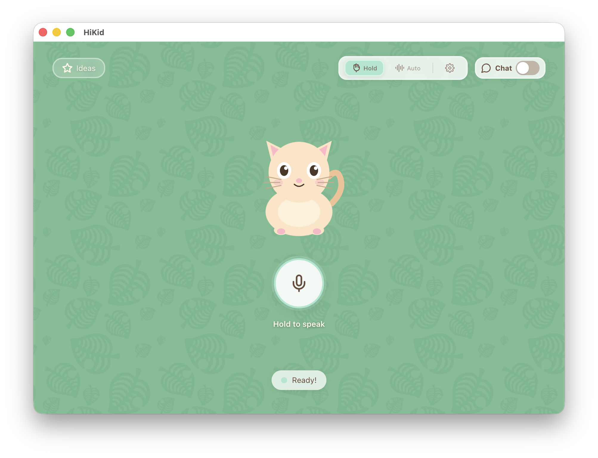
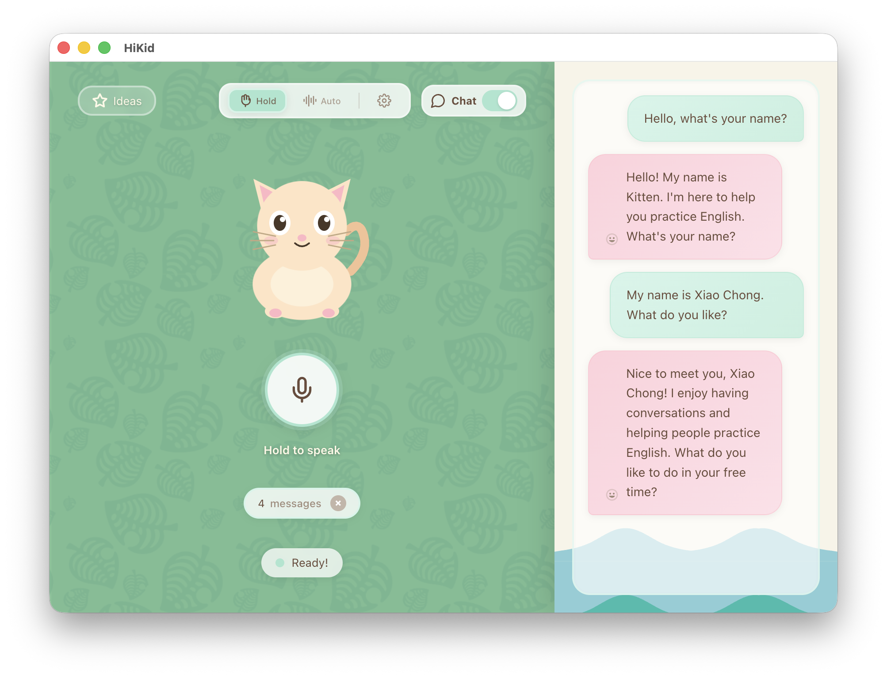

# 🎈 HiKid

> *Hi! I'm your AI English Pal. Let's talk!*

[](https://www.electronjs.org/)
[](https://react.dev/)
[](https://www.typescriptlang.org/)

---

## 🌟 这是什么？

HiKid 是一个**完全免费、永久免费**的开源桌面应用，专为**非英语国家的小朋友**打造——帮助他们练习英语口语和听力。

对着麦克风说 "Hello"，它就会用英语跟你聊天、讲故事、猜谜语——完全离线，所有数据和 AI 都在本地运行，不上传任何云端。

- 🗣️ **开口就能聊** —— 不用打字，直接说话，AI 听得懂
- 🧠 **聪明又耐心** —— 聊什么话题都可以，说得慢、说得简单也没关系
- 🎨 **长得像动画片** —— 界面可爱，小朋友会喜欢
- 🔒 **隐私安全** —— 对话、语音、模型，全部在本地运行
- 🌏 **没网也能玩** —— 录音、识别、合成、对话，全走本地流水线

> 🍎 **目前仅支持 macOS**，Windows 和 Linux 版本正在计划中，欢迎来帮忙！





## 🚀 快速开始

### 环境要求

- macOS 12.0+（Apple Silicon / Intel）
- Node.js >= 20
- npm

### 安装

```bash
# 1. 克隆仓库
git clone https://github.com/xiaochong/hi-kid.git
cd hi-kid

# 2. 安装依赖
npm install
```

### 开发

```bash
# 启动开发服务器（热更新）
npm run dev

# 类型检查
npm run typecheck

# 代码格式化
npm run format
```

### 构建

```bash
# 全平台
npm run build

# macOS
npm run build:mac

# 解包输出（不打包成安装包）
npm run build:unpack
```

> 详细的外部依赖安装（SoX、ASR/TTS 服务器、模型文件等）请参考 [INSTALL.md](INSTALL.md)。

## 🏗️ 技术架构

HiKid 的语音对话是一条完整的 **本地流水线**：

```
用户说话 → SoX(rec) 录音 + VAD 检测 ──→ ASR 服务器 语音转文字
                                                  ↓
SoX(play) 播放 PCM 音频 ←─ TTS 服务器 语音合成 ←─ LLM 生成回复
```

| 组件 | 职责 |
|------|------|
| **SoX** | 音频录制、播放、格式转换与分析 |
| **kitten-tts-server** | 本地语音合成 (TTS)，SSE 流式返回 PCM |
| **asr-server** | 本地语音识别 (ASR)，基于 Qwen3-ASR-0.6B |
| **Ollama** | 本地大语言模型，默认 `qwen3:0.6b` |

项目结构：

```
src/
├── main/          # Electron 主进程
├── preload/       # 预加载脚本（IPC 桥接）
└── renderer/      # React 渲染进程
```

## 🤝 贡献指南

欢迎提交 Issue 和 PR！

- `dev` 分支是活跃开发分支
- `main` 分支是稳定分支，用于合并 PR
- 提交前请运行 `npm run lint` 和 `npm run typecheck`

## 🙏 致谢

HiKid 站在巨人的肩膀上：

| 项目 | 用途 |
|------|------|
| [Electron](https://www.electronjs.org/) | 跨平台桌面应用框架 |
| [React](https://react.dev/) | 用户界面构建 |
| [Vite](https://vitejs.dev/) | 极速构建工具 |
| [@mariozechner/pi-agent-core](https://www.npmjs.com/package/@mariozechner/pi-agent-core) | Agent 编排与事件流框架 |
| [kitten-tts-server](https://github.com/second-state/kitten_tts_rs) | 本地语音合成引擎 |
| [Qwen3-ASR-0.6B](https://github.com/QwenLM/Qwen3) | 本地语音识别模型 |
| [Ollama](https://ollama.com/) | 本地大语言模型运行环境 |
| [animal-island-ui](https://github.com/guokaigdg/animal-island-ui) | 可爱的 UI 组件 |

以及所有间接依赖它们的开发者们——是你们让开源世界如此精彩！

## ⚠️ 声明

- 本项目仅用于个人学习、研究与非商业展示，禁止任何形式的商业使用、二次售卖或盈利行为。
- 本项目使用的 UI 组件库 [animal-island-ui](https://github.com/guokaigdg/animal-island-ui)，界面设计灵感参考了经典游戏风格，但所有素材和风格仅为设计参考，不构成对原作品的复制或侵权。

## 📄 许可证

MIT

---

<p align="center">
  Made with 💛 for kids around the world
</p>
