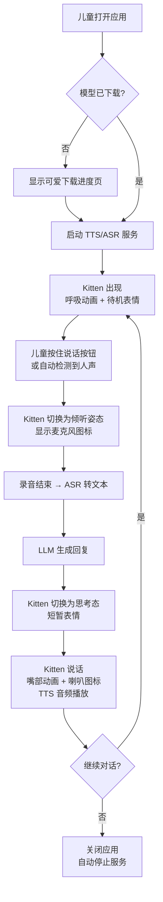

# EchoKid 语音对话功能整合需求

## Problem Frame

EchoKid 是一个面向非英语国家儿童的 AI 英语口语练习桌面应用（Electron + React）。目前已有的 kitten-demo 是一个在控制台运行的完整语音对话系统，核心流程为：录音（VAD）→ ASR 转文本 → LLM 生成回复 → TTS 语音合成 → 播放。现在需要把这套能力整合进 EchoKid，并赋予它童趣、精美、专业的 UI 体验，让儿童能够直观、愉悦地与 AI 对话伙伴练习英语口语。

目标用户是 7-12 岁、英语处于初级水平的儿童。界面需要零学习门槛，交互需要符合儿童心智模型，视觉需要足够吸引孩子持续使用。

## User Flow

## Requirements

### Core Conversation Experience

- **R1.** 应用启动后自动在后台启动 TTS 和 ASR 本地服务，无需用户手动操作。
- **R2.** 语音对话闭环必须完整可用：录音 → ASR → LLM → TTS → 播放，任一环节失败时都必须被"童话化"处理——不显示任何技术错误信息，而是由 Kitten 用角色口吻表达（如 "My ears are sleepy, can you say it louder?"）。孩子永远看到的是 Kitten 在说话或需要帮助，而非冰冷的 error message。
- **R3.** 对话内容应以适合小学三年级英语水平的词汇为基础，风格风趣幽默，能主动引起孩子的兴趣。
- **R4.** 播放 AI 语音时，如果检测到用户开始说话，应支持打断当前播放并立即开始新一轮录音。
- **R19.** 首次启动且服务就绪后，Kitten 应主动用语音打招呼（如 "Hi! I'm Kitten!"），并伴随视觉引导（如发光箭头或手形光标指向说话按钮），让孩子在 3 次操作内明白如何开始对话。
- **R20.** 如果孩子在 20-30 秒内没有说话（待机状态），Kitten 应主动开口发起话题引导（如 "What do you want to talk about?" 或随机提出有趣话题），防止孩子误以为 App 卡住了。

### Kitten Character & Animation

- **R5.** 界面中央应有一个具象的 kitten SVG 角色作为 AI 伙伴的视觉锚点，取代抽象的文字或图标。
- **R6.** Kitten 应有持续的呼吸/微浮动动画，让角色感觉"活着"，而不是静止的图片。
- **R7.** Kitten 的表情和姿态应根据对话状态实时变化：
  - **待机**：闭眼/半闭眼呼吸，偶尔眨眼，放松微笑。
  - **倾听**：耳朵微微竖起，眼神聚焦，表现出"在认真听"的神态。
  - **思考**：短暂歪头或思考气泡（1-2 秒过渡）。
  - **说话**：嘴部有开口/闭合的微动画，SVG 右下角显示一个小喇叭图标。
  - **被打断**：当孩子打断 Kitten 说话时，先呈现 300-500ms 的"惊讶/被打断"微表情（如眼睛短暂睁大/歪头），然后再切换到倾听状态。
- **R8.** Kitten 在说话时应明确区别于倾听状态，状态切换应在 200ms 内响应，不可出现状态与音频不同步。

### UI & Visual Design

- **R9.** 整体视觉风格参考动物森友会（Animal Crossing）的温馨、手绘、圆润质感：柔和的马卡龙配色、大圆角、轻微的拟物质感（如毛茸茸边缘或柔软阴影）。
- **R10.** 界面元素应足够大，适合儿童的手指/鼠标操作，按钮点击区域不小于 48×48dp 等效尺寸。
- **R11.** 提供一个显眼的文字显示开关，允许切换是否显示对话字幕。开启时，用户说的话和 AI 的回复应以可爱的聊天气泡形式出现在界面上（推荐底部或侧边），字体大而清晰。
- **R12.** 所有文字内容（包括字幕和提示）必须同时支持中英双语，或至少在中文系统下显示中文引导文字。

### Voice Interaction

- **R13.** 默认开启自动语音检测（VAD）：检测到人声自动开始录音，检测到静音自动结束。同时提供一个显眼的、大的圆形"按住说话"按钮作为备选交互方式。
- **R14.** 录音时应有明确的视觉反馈，让用户知道"我正在被听见"（如录音波形或按钮按压动画）。
- **R15.** 每轮对话结束后应有短暂缓冲（约 500ms），避免 AI 刚说完话就立即被自己的回声触发新一轮录音。

### Packaging & Distribution

- **R16.** Electron 应用包内应包含 TTS（kitten-tts-server）和 ASR（asr-server）的可执行文件，无需用户手动安装 Rust 二进制。
- **R17.** TTS 和 ASR 的模型文件（可能数百 MB 到数 GB）不直接打包进应用包，而是在首次启动时自动下载到本地缓存目录。下载过程应有儿童友好的进度界面（可爱的进度条或 kitten 互动动画）。
- **R18.** 模型下载应支持断点续传，且只下载一次，后续启动直接使用本地缓存。

## Success Criteria

- 一个 7 岁儿童首次打开应用后，能在 3 次点击/操作内开始第一次英语对话。
- Kitten 的视觉状态（听/说/待机）与实际的音频录制/播放完全同步，没有可感知的延迟。
- 语音对话的端到端延迟（用户说完到 AI 开始说话）不超过 3 秒（在本地模型正常运行条件下）。
- 应用安装后无需 terminal 命令，家长只需双击安装包即可。

## Scope Boundaries

- **非目标：用户系统**。暂不考虑多用户账户、家长控制面板、学习进度追踪。按单设备单用户设计。
- **非目标：对话历史持久化**。当前阶段对话为单轮会话，关闭应用后不保留历史。后续可扩展。
- **非目标：游戏化机制**。不引入积分、等级、徽章、连胜等激励系统。纯粹聚焦对话体验本身。
- **非目标：多语言支持**。AI 回复始终为英语，但界面文字支持中文。
- **非目标：离线 LLM**。LLM 仍通过可配置的 OpenAI 兼容 API 调用，不捆绑本地大模型。

## Key Decisions

- **Main 进程承载核心音频与 Agent 逻辑**：复用 kitten-demo 已有的成熟音频链路（sox VAD、pi-agent-core Agent、流式 TTS），避免重写带来的回归风险。Renderer 通过 IPC 订阅状态变化来驱动 kitten 动画。
- **直接依赖 animal-island-ui 作为视觉组件库**：使用其 React 组件、配色、动画和布局系统，快速获得动物森友会风格的童趣 UI。需注意该库虽为 MIT 协议，但作者明确声明"仅限学习使用，禁止商业使用和二次售卖"。本项目为开源非盈利项目，处于该限制允许范围内，但需关注后续版本更新和许可证变化。
- **流式 TTS 与状态同步通过 IPC 桥接**：main 进程在音频播放开始/结束时向 renderer 发送 IPC 事件，确保 kitten 说话动画与音频播放精确同步。
- **Kitten 主动引导和待机互动**：首次启动和长时间沉默时由 Kitten 主动开口，降低儿童的使用门槛，防止"不知道该做什么"的困惑。
- **打断时的微表情过渡**：被打断不是立即切换状态，而是有一个 300-500ms 的"惊讶"微表情，让角色更有生命感和性格。
- **错误信息完全童话化**：任何技术故障都不暴露为 error message，而是包装成 Kitten 的角色台词（如 "My voice is hiding"），维持"Kitten 是一个真实伙伴"的沉浸感。

## Dependencies / Assumptions

- 目标设备上已安装 sox（目前 kitten-demo 的录音和音频分析依赖 sox/rec），或者需要在打包时一并处理 sox 的可用性。
- LLM API（OpenAI 兼容端点）由用户或家长提前配置好。暂不解决"零配置开箱即用"的 LLM 来源问题。

## Outstanding Questions

### Resolve Before Planning

- [无]

### Deferred to Planning

- `[Affects R16]` [Technical] sox 是否也需要随应用打包，还是可以替换为纯 Node.js/Electron 内置方案？
- `[Affects R11]` [Needs research] 聊天气泡的文字显示模式是底部向上滚动，还是侧边固定面板，哪种对儿童阅读更友好？
- `[Affects 全局]` [Technical] pi-agent-core 的事件流通过 IPC 传输到 renderer 的性能和实时性如何，是否需要中间缓冲或 throttling？
- `[Affects R17]` [Needs research] 模型文件的 CDN/下载源是什么，是否提供版本管理和增量更新能力？

## Next Steps

-> `/ce:plan` for structured implementation planning
