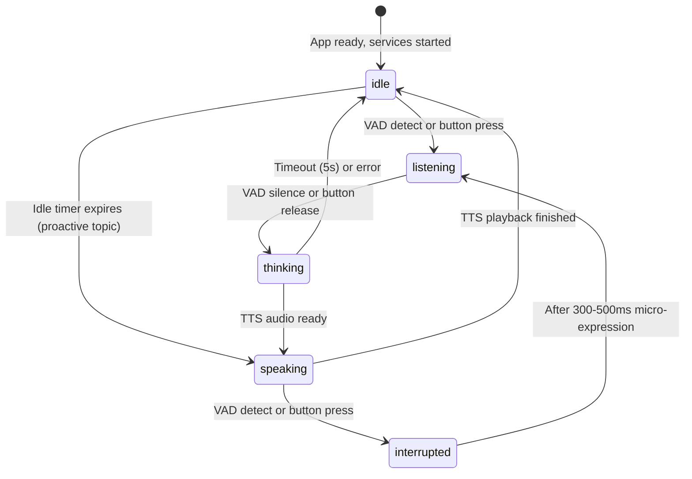
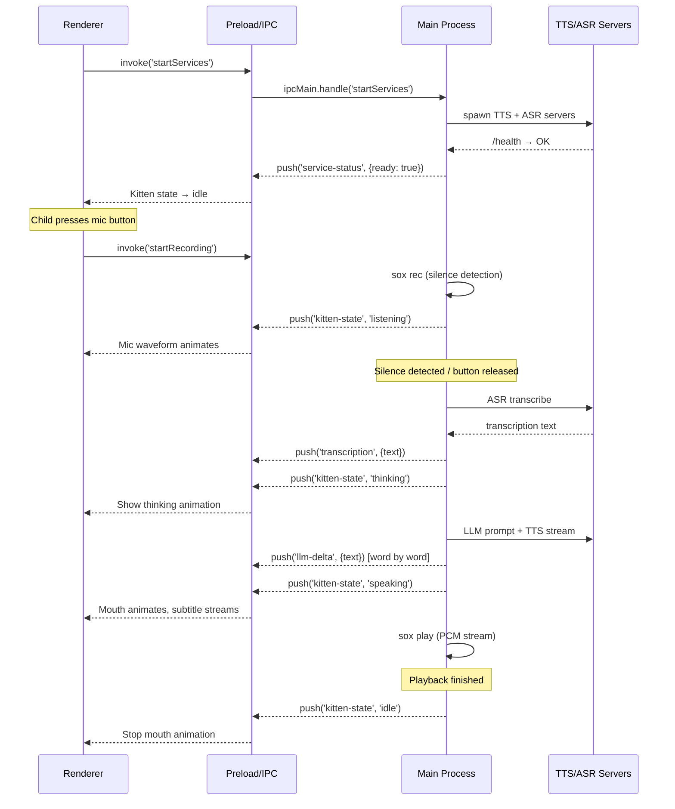

# feat: Integrate AI voice conversation with Kitten character UI

## Overview

Port the existing `kitten-demo` console-based AI English conversation engine into EchoKid's Electron + React desktop app, wrapping it in a child-friendly UI built around a stateful Kitten SVG character. The work spans all three Electron processes (main, preload, renderer) and introduces a new visual identity, real-time state synchronization, model download infrastructure, and fairy-tale error handling.

## Problem Frame

EchoKid currently ships only the electron-vite default template — a dark-themed welcome screen with no conversational functionality. The `kitten-demo` CLI application (in a separate repo) already implements a complete voice loop (VAD recording → ASR → LLM → streaming TTS → playback) using local Rust services and Node.js audio tools. This plan defines how to lift that proven engine into EchoKid's multi-process architecture and dress it with a polished, Animal Crossing-inspired experience for children.

(see origin: [docs/brainstorms/2026-04-18-echokid-voice-conversation-integration-requirements.md](../brainstorms/2026-04-18-echokid-voice-conversation-integration-requirements.md))

## Requirements Trace

- **R1.** Auto-start TTS/ASR services on app launch
- **R2.** Complete conversation loop with fairy-tale error wrapping
- **R3.** 3rd-grade English vocabulary, playful tone
- **R4.** Interrupt support during TTS playback
- **R5-R8.** Kitten SVG character with breathing animation and 5 state-driven expressions
- **R9-R12.** Animal Crossing visual style, large touch targets, bilingual UI, toggleable subtitles
- **R13-R15.** VAD auto-detect + press-and-hold button, recording feedback, 500ms post-TTS buffer
- **R16-R18.** Bundle TTS/ASR binaries, first-launch model download with resume
- **R19.** First-launch onboarding with Kitten voice greeting
- **R20.** Proactive topic initiation after 20-30s of silence

## Scope Boundaries

- **Non-goal:** Multi-user accounts, conversation history persistence, gamification, multilingual AI replies, offline LLM
- **Deferred to separate tasks:** Cross-platform sox binary bundling (see Key Technical Decisions). The MVP documents sox as a system dependency with a friendly installation prompt.
- **Deferred to separate tasks:** Conversation history UI (ephemeral session only)
- **Deferred to separate tasks:** SVG decorations / Kitten customization (colors, accessories)

## Context & Research

### Relevant Code and Patterns

- **Electron main process entry:** `src/main/index.ts` — creates 900×670 `BrowserWindow` with `sandbox: false`, registers a single `ping` IPC handler. All main-process logic for services, recording, and Agent must be added here or imported.
- **Preload scaffolding:** `src/preload/index.ts` / `src/preload/index.d.ts` — exposes an empty `window.api` typed as `unknown`. Must be extended with typed channels.
- **Renderer entry:** `src/renderer/src/App.tsx` — renders the electron-vite template. Fully replaceable.
- **Build config:** `electron-builder.yml` has template values (`productName: electron-app-demo1`) but already configures `asarUnpack: resources/**` for native binaries.
- **Audio engine origin:** `kitten-demo/src/main.ts`, `kitten-demo/src/agent.ts`, `kitten-demo/src/servers.ts` — proven pipeline using sox/rec, pi-agent-core, and local HTTP servers.
- **IPC pattern (from CLAUDE.md):** Define channel → expose via preload → handle in `ipcMain` → consume in renderer.

### Institutional Learnings

- No prior work in `docs/solutions/`. The requirements document written today is the only institutional knowledge.

### External References

- `animal-island-ui@0.1.0` — Animal Crossing-inspired React component library (MIT, "learning purpose only"). Provides Button, Card, Switch, Modal, Collapse, Cursor, Divider.
- `kitten-demo` (separate repo) — Reference implementation for audio pipeline.

## Key Technical Decisions

- **Main process hosts audio/Agent logic (reused from kitten-demo):** The proven sox-based recording, ASR/TTS HTTP services, and pi-agent-core Agent run in the main process. Renderer drives UI exclusively via IPC. Rationale: avoids rewriting a stable audio pipeline and maintains sentence-level TTS streaming behavior.
- **State machine lives in renderer, fed by IPC events:** Main process sends `{state: 'idle' | 'listening' | 'thinking' | 'speaking' | 'interrupted'}` events. Renderer applies CSS transitions and SVG state changes. Rationale: animation timing must be frame-synced; Electron IPC latency (~1ms) is negligible for 200ms transitions.
- **sox remains a system dependency for MVP:** EchoKid checks for sox at startup. If missing, shows a child-friendly prompt asking the parent to install it (with copy-paste commands). Rationale: bundling platform-specific sox binaries for macOS/Windows/Linux is a significant packaging task. Deferred to a future iteration.
- **Press-and-hold is the default interaction mode:** Both VAD and press-and-hold are available in the app, but only one is active at a time (mode switch in settings). Default to press-and-hold to avoid accidental VAD triggers. Rationale: children may produce ambient noise; a deliberate button press is a clearer mental model.
- **Model downloads use HTTP range requests with file persistence in `userData`:** Enables resume on app restart. Download progress is streamed to renderer via IPC.
- **Conversation text is ephemeral:** Subtitles exist only in renderer memory. On app close, history is lost. Rationale: scope boundary excludes history persistence.
- **LLM text deltas forwarded through IPC for subtitle streaming:** pi-agent-core emits `text_delta` events; main forwards them to renderer so subtitles can appear word-by-word. Rationale: aligns with R11 (toggleable subtitles) without adding architectural complexity.

## Open Questions

### Resolved During Planning

- **sox bundling:** Deferred to future iteration; document as system dependency for MVP.
- **Interaction mode default:** Press-and-hold default, VAD toggleable in settings.
- **Interruption semantics during THINKING:** Abort in-flight LLM request and discard old ASR text. Start fresh pipeline with new utterance.
- **Proactive silence timer reset:** Starts on `idle` entry. Resets on VAD detection or button press. UI interactions (toggles, clicks) do NOT reset.
- **Thinking state timing:** Minimum 500ms display. Transition to speaking when TTS is ready, capped at 5s (then fairy-tale error).
- **Pipeline failure behavior:** 1 silent retry behind the scenes. On second failure, Kitten speaks a fairy-tale message (e.g., "My ears are sleepy, can you say it louder?").
- **Chat bubble behavior:** Bottom-up scroll, latest at bottom. Visible while toggle is on; fade on toggle off.
- **LLM unreachable:** App is non-functional. Kitten says "I'm taking a little nap" with a retry button. No offline practice mode.

### Deferred to Implementation

- **Exact CSS animation curves for Kitten breathing:** Will be tuned by eye during implementation.
- **animal-island-ui custom theme overrides:** Specific color tokens and CSS variable mapping discovered during component integration.
- **Optimal VAD threshold values for children's voices:** May require tuning sox silence parameters per microphone/environment.
- **pi-agent-core IPC event batching:** If text_delta events exceed ~60fps under load, investigate throttling.

## Output Structure

```
src/
├── main/
│   ├── index.ts                      # Entry, BrowserWindow, lifecycle hooks
│   ├── ipc/
│   │   └── channels.ts               # IPC handler registry (invoke + push events)
│   └── services/
│       ├── servers.ts                # TTS/ASR spawn, health checks, shutdown
│       ├── agent.ts                  # pi-agent-core wrapper, event→IPC mapping
│       ├── recorder.ts               # sox rec wrapper with silence/VAD
│       ├── playback.ts               # sox play wrapper, interrupt support
│       └── download.ts               # Model download with range-request resume
├── preload/
│   ├── index.ts                      # contextBridge exposeInMainWorld('api', ...)
│   └── index.d.ts                    # Window.api type declarations
└── renderer/
    └── src/
        ├── main.tsx
        ├── App.tsx                   # Root layout, orchestrates screens
        ├── env.d.ts
        ├── assets/
        │   ├── base.css              # Global reset, CSS variables
        │   └── main.css              # App layout, Kitten-specific animations
        ├── components/
        │   ├── Kitten.tsx            # SVG character + state-driven animations
        │   ├── Kitten.module.css     # (or Kitten.css if not using CSS modules)
        │   ├── VoiceButton.tsx       # Large press-and-hold mic button
        │   ├── ChatBubbles.tsx       # Scrollable conversation subtitle list
        │   ├── TextToggle.tsx        # Text display on/off switch
        │   ├── DownloadScreen.tsx    # Model download progress + Kitten animation
        │   ├── Onboarding.tsx        # First-launch greeting + pointer overlay
        │   └── SettingsPanel.tsx     # Mode switch (press-and-hold / VAD)
        ├── hooks/
        │   └── useConversation.ts    # Subscribes to IPC, exposes conversation state
        └── types/
            └── conversation.ts       # Shared renderer types (KittenState, Message, etc.)
resources/                            # Bundled native binaries (TTS/ASR)
```

## High-Level Technical Design

> _This illustrates the intended approach and is directional guidance for review, not implementation specification. The implementing agent should treat it as context, not code to reproduce._

### Kitten State Machine



### Conversation Sequence (Happy Path)



### Component Responsibilities

| Process      | Responsibility                                                                                                                                                            |
| ------------ | ------------------------------------------------------------------------------------------------------------------------------------------------------------------------- |
| **Main**     | Spawn/manage TTS/ASR servers. Run sox recording with VAD. Manage pi-agent-core Agent. Handle ASR/LLM/TTS pipeline. Send state/events to renderer. Handle model downloads. |
| **Preload**  | Typed IPC bridge: `invoke` for commands, `on` for event subscriptions.                                                                                                    |
| **Renderer** | Render Kitten SVG with CSS animations. Display mic button, chat bubbles, download screen. Subscribe to IPC events and update React state. No audio logic.                 |

## Implementation Units

### Phase 1: Foundation

- [ ] **Unit 1: IPC Contract & Main Process Audio Engine**

**Goal:** Establish the complete typed IPC interface and port the kitten-demo audio/Agent pipeline into the Electron main process.

**Requirements:** R1, R2, R3, R4, R13, R15

**Dependencies:** None (first unit)

**Files:**

- Create: `src/preload/index.ts` (rewrite `api` object with typed channels)
- Create: `src/preload/index.d.ts` (declare `Window.api` interface)
- Create: `src/main/ipc/channels.ts` (IPC handler registry)
- Create: `src/main/services/servers.ts` (TTS/ASR spawn, health, shutdown)
- Create: `src/main/services/agent.ts` (pi-agent-core Agent wrapper, fairy-tale error mapping)
- Create: `src/main/services/recorder.ts` (sox rec with silence VAD)
- Create: `src/main/services/playback.ts` (sox play with interrupt support)
- Modify: `src/main/index.ts` (import and register IPC handlers)
- Modify: `package.json` (add `pi-agent-core`, `pi-ai` or confirm they are dependencies)
- Test: `src/main/services/__tests__/.gitkeep` (no test runner yet; see verification)

**Approach:**

- Define IPC channels using `ipcMain.handle` for request/response and `ipcMain.on` + `webContents.send` for push events.
- Port `kitten-demo/src/servers.ts` logic into `src/main/services/servers.ts`.
- Port `kitten-demo/src/agent.ts` into `src/main/services/agent.ts`, replacing `process.stdout.write` with IPC pushes.
- Port recording logic from `kitten-demo/src/main.ts` into `src/main/services/recorder.ts`.
- Implement interrupt: kill current `sox play` child process on incoming `interrupt` invoke.
- Fairy-tale error mapping: each catch block in the pipeline maps to a predefined Kitten message string and sends `{type: 'error', message: '...'}` via IPC.

**Patterns to follow:**

- `src/preload/index.ts` existing `contextBridge.exposeInMainWorld` pattern.
- `kitten-demo/src/agent.ts` sentence-level TTS streaming with `createTtsStreamFn`.
- `kitten-demo/src/servers.ts` spawn + health-check loop.

**Test scenarios:**

- **Happy path (Integration):** App launches → `invoke('startServices')` → TTS/ASR servers become ready → IPC push `service-status: ready` received in renderer.
- **Edge case:** Port already in use on startup. Main process should detect bind failure, kill existing process if owned by app, or report error via IPC.
- **Error path:** sox not installed. Startup check detects missing binary. IPC push sends `error` with fairy-tale message + technical detail for parent-facing UI.
- **Error path:** ASR returns empty transcription. Recorder detects low RMS or empty text. Agent skips LLM and Kitten speaks "My ears are sleepy..." via IPC.
- **Integration:** Interrupt during TTS playback. `invoke('interrupt')` kills sox play process. Agent pipeline resets. Kitten state pushes `interrupted` → `listening` sequence.

**Verification:**

- `npm run typecheck:node` passes with no errors in new main/preload files.
- `npm run dev` launches. DevTools console shows `service-status: ready` IPC event.
- Manual test: Press F12, run `await window.api.startServices()` → returns successfully.
- Manual test: `window.api.onKittenState((s) => console.log(s))` logs state changes.

- [ ] **Unit 2: App Shell & Animal-Island-UI Theme Integration**

**Goal:** Strip the electron-vite template and scaffold a new application shell with the Animal Crossing-inspired visual foundation.

**Requirements:** R9, R10, R12

**Dependencies:** None (can parallel with Unit 1)

**Files:**

- Modify: `src/renderer/src/App.tsx` (replace template with new layout)
- Modify: `src/renderer/src/assets/main.css` (new layout, color variables)
- Modify: `src/renderer/src/assets/base.css` (theme variables, font setup)
- Delete: `src/renderer/src/assets/electron.svg`
- Delete: `src/renderer/src/assets/wavy-lines.svg`
- Delete: `src/renderer/src/components/Versions.tsx`
- Modify: `package.json` (add `animal-island-ui` dependency)
- Modify: `src/renderer/index.html` (update CSP if external fonts needed)
- Test: `src/renderer/src/components/__tests__/.gitkeep`

**Approach:**

- Install `animal-island-ui`.
- Replace dark template with soft macaron palette (pastel pinks, creams, soft greens). Use CSS custom properties for colors so they can be tuned without touching component code.
- Set base font to a rounded, child-friendly sans-serif (e.g., system-ui with fallback to a rounded web font if loaded).
- Structure `App.tsx` as a screen router: `DownloadScreen` → `Onboarding` → `ConversationScreen`.
- Ensure all interactive elements have minimum 48×48px touch targets.
- Bilingual setup: all user-facing strings use a simple i18n object (English + Chinese). No heavy i18n library needed for two languages.

**Patterns to follow:**

- `animal-island-ui` component usage from its README/docs.
- Existing `src/renderer/src/main.tsx` mount pattern.

**Test scenarios:**

- **Happy path:** `npm run dev` shows new app shell with soft background, no electron-vite branding.
- **Happy path:** `animal-island-ui` Button and Card render without console errors.
- **Edge case:** Resize window to 800×600 and 1200×800. Layout remains usable; Kitten stays centered.
- **Integration:** Strings render in correct language based on a hardcoded or detected locale.

**Verification:**

- Visual check: no template assets remain. App shows light/soft background.
- `npm run typecheck:web` passes.
- `npm run lint` passes.

### Phase 2: Core UI & Experience

- [ ] **Unit 3: Kitten SVG Character & Animation System**

**Goal:** Create the central Kitten SVG component with CSS-driven breathing animation and state-driven expression changes.

**Requirements:** R5, R6, R7, R8

**Dependencies:** Unit 2

**Files:**

- Create: `src/renderer/src/components/Kitten.tsx`
- Create: `src/renderer/src/components/Kitten.module.css` (or `Kitten.css`)
- Create: `src/renderer/src/types/conversation.ts` (KittenState union type)
- Test: `src/renderer/src/components/__tests__/Kitten.test.tsx` (future)

**Approach:**

- Design an SVG kitten with layered groups: body/tail (always animating), head, ears, eyes (state-driven), mouth (speaking animation), accessory icons (mic/speaker indicators).
- Breathing animation: CSS `@keyframes` on `transform: scale` and `translateY` with `animation: breathe 3s ease-in-out infinite`.
- Blinking: Random-interval CSS animation on eye opacity (e.g., every 3-7 seconds).
- State transitions: React receives `kittenState` prop. Apply CSS classes per state. Use `transition: all 0.2s ease` for the 200ms transition requirement.
- Speaking mouth: Simple scale/rotate animation on mouth shape element.
- Speaker icon: Absolutely positioned small SVG in bottom-right corner, visible only during `speaking` state.
- Microphone icon: Visible only during `listening` state.
- Interrupted state: Apply a "surprise" CSS class for 300-500ms (eyes scale up), then transition callback fires to `listening`.

**Patterns to follow:**

- CSS animation conventions from `animal-island-ui` if any; otherwise pure CSS.
- React controlled component pattern with `kittenState` prop.

**Test scenarios:**

- **Happy path:** Kitten renders in `idle` state with continuous breathing animation.
- **Happy path:** Rapid state cycling (`idle` → `listening` → `thinking` → `speaking` → `idle`) within 3 seconds. Animations do not break or leave visual artifacts.
- **Edge case:** State changes every 100ms for 2 seconds. Component remains stable (no memory leaks, no CSS animation pile-up).
- **Edge case:** Interruption sequence: `speaking` → `interrupted` → `listening`. The 300-500ms surprise animation completes before listening begins.
- **Integration:** IPC pushes `kitten-state: speaking`. `useConversation` hook updates state. `Kitten` re-renders with mouth animation and speaker icon visible.

**Verification:**

- Visual check: Kitten is centered, proportional, and appealing.
- DevTools Performance tab: No layout thrashing during animation.
- Manual state injection: Temporarily render `<Kitten state="interrupted" />` directly to verify the surprise expression.

- [ ] **Unit 4: Voice Interaction, Conversation Hook & State Sync**

**Goal:** Build the press-and-hold microphone button, the conversation state hook, and wire IPC subscriptions into the renderer.

**Requirements:** R4, R8, R13, R14, R15

**Dependencies:** Unit 1, Unit 3

**Files:**

- Create: `src/renderer/src/components/VoiceButton.tsx`
- Create: `src/renderer/src/hooks/useConversation.ts`
- Create: `src/renderer/src/components/SettingsPanel.tsx`
- Modify: `src/renderer/src/App.tsx` (integrate components)
- Test: `src/renderer/src/hooks/__tests__/useConversation.test.ts` (future)

**Approach:**

- `useConversation.ts`: Custom hook that subscribes to all IPC events (`kitten-state`, `transcription`, `llm-delta`, `error`, `service-status`). Exposes `{kittenState, messages, isRecording, error, startRecording, stopRecording, interrupt, downloadStatus}`.
- VoiceButton: Large circular button with `onPointerDown` / `onPointerUp` handlers. When pressed, show a waveform or pulse animation around the button. Size: 80-100px diameter.
- Settings toggle: Small gear or mode icon. Switch between "press-and-hold" and "VAD" modes. Store preference in `localStorage`.
- VAD mode: When active, button is hidden or shows a "listening..." indicator. The main process handles VAD entirely.
- Press-and-hold mode: Renderer sends `invoke('startRecording')` on press and `invoke('stopRecording')` on release. Main process stops sox rec on release.
- 500ms post-TTS buffer: Main process enforces this after playback ends before accepting new recording triggers.
- Idle timer: Main process tracks time since `idle` state entry. After 20-30 seconds, proactively sends a topic to the Agent and pushes `kitten-state: speaking`.

**Patterns to follow:**

- React custom hook pattern. Clean up IPC listeners on unmount.

**Test scenarios:**

- **Happy path:** Press button → `kitten-state: listening` → release → `thinking` → `speaking` → `idle`.
- **Happy path (VAD):** Switch to VAD mode. Speak naturally. Pipeline runs without button interaction.
- **Edge case:** Button pressed for 0.1s and released. Should still trigger recording (sox may capture only silence; ASR returns empty; Kitten asks to repeat).
- **Edge case (Integration):** Interruption: While Kitten is speaking, press button. TTS stops. Kitten shows `interrupted` for 400ms, then `listening`.
- **Error path:** Recording without microphone permission. sox fails. IPC pushes error. Kitten speaks fairy-tale message about needing a microphone.
- **Integration:** 25 seconds of silence after TTS ends. Main process triggers proactive topic. Kitten speaks "What do you want to talk about?".

**Verification:**

- Full manual conversation round-trip works end-to-end.
- State transitions visible in React DevTools state panel.
- `npm run typecheck:web` passes.

- [ ] **Unit 5: Chat Subtitles & Text Display Toggle**

**Goal:** Implement the toggleable conversation text display with cute chat bubbles.

**Requirements:** R11, R12

**Dependencies:** Unit 2, Unit 4

**Files:**

- Create: `src/renderer/src/components/ChatBubbles.tsx`
- Create: `src/renderer/src/components/TextToggle.tsx`
- Modify: `src/renderer/src/App.tsx`
- Test: `src/renderer/src/components/__tests__/ChatBubbles.test.tsx` (future)

**Approach:**

- `TextToggle`: A `Switch` from `animal-island-ui` or a custom large toggle. Label in both languages: "字幕 / Subtitles".
- `ChatBubbles`: Scrollable container at the bottom or left side. Messages accumulate in an array managed by `useConversation`. Each message has `{role: 'user' | 'assistant', text: string}`.
- User messages appear in right-aligned bubbles. AI messages in left-aligned bubbles with a small Kitten icon.
- AI messages stream in word-by-word as `llm-delta` events arrive.
- Auto-scroll to bottom on new message.
- Bubbles use soft rounded corners, pastel background colors, and large readable font (18px+).
- Messages are ephemeral — no persistence. Array resets on app restart.

**Patterns to follow:**

- `animal-island-ui` Card or custom styled divs for bubbles.

**Test scenarios:**

- **Happy path:** Toggle ON → speak → user bubble appears → AI response streams in → AI bubble appears.
- **Happy path:** Toggle OFF → bubbles disappear. Toggle ON again → previous session bubbles reappear? No — scope says ephemeral, so toggling off/on within a session should keep current session bubbles.
- **Edge case:** 20 messages accumulate. Scrollbar appears. Container remains performant.
- **Edge case:** Very long AI response (>500 words). Bubble expands vertically. Layout remains stable.
- **Integration:** Text Toggle state is independent of conversation pipeline. Toggling does not affect audio or Kitten state.

**Verification:**

- Toggle works smoothly with no audio interruption.
- Bubbles are readable at 900×670 window size.
- Bilingual labels render correctly.

### Phase 3: Launch Orchestration & Polish

- [ ] **Unit 6: Model Download Manager & First-Launch Flow**

**Goal:** Detect missing models, download them with resumable progress, and sequence service startup after download completion.

**Requirements:** R1, R17, R18

**Dependencies:** Unit 1

**Files:**

- Create: `src/main/services/download.ts`
- Create: `src/renderer/src/components/DownloadScreen.tsx`
- Modify: `src/main/index.ts` (startup sequence: check → download → start services)
- Modify: `src/renderer/src/App.tsx` (screen routing)
- Test: `src/main/services/__tests__/.gitkeep`

**Approach:**

- `download.ts`: Check `app.getPath('userData')/models/` for model directories. If missing, download from configured URLs using Node.js `https` with `Range` headers for resume.
- Track download progress (bytes downloaded / total). Save partial files with `.part` extension. Rename to final on completion.
- Verify checksum (SHA256) after download.
- Download screen: Full-screen cute UI with Kitten bouncing/waiting animation, progress bar, and encouraging messages ("Kitten is getting ready...").
- On app close during download: save progress metadata to a JSON file. On next launch, read metadata and resume from byte offset.
- After download succeeds, auto-trigger service startup (same as `invoke('startServices')`).

**Patterns to follow:**

- Node.js https module for downloads (no extra dependency needed).

**Test scenarios:**

- **Happy path:** First launch, no models. Download screen shows. Progress bar advances. Download completes. Services start. App transitions to idle Kitten.
- **Edge case:** Partial download exists (`.part` file + metadata). Resume from correct byte offset. Progress bar starts at partial percentage.
- **Error path:** Network timeout during download. Retry once after 3 seconds. If still failing, show fairy-tale message ("Kitten's snacks got lost on the way, try again?") with retry button.
- **Error path:** Disk full during download. Graceful failure with clear message for parent.
- **Edge case:** User closes app at 50% download. Next launch resumes from 50%.
- **Integration:** Download progress events (`download-progress`) correctly update renderer progress bar in real time.

**Verification:**

- Delete model directory, restart app. Full download + startup succeeds.
- Interrupt download mid-way, restart app. Resume succeeds.
- `npm run typecheck:node` passes.

- [ ] **Unit 7: Onboarding, Proactive Topics & Fairy-Tale Error System**

**Goal:** First-launch greeting experience, idle timeout proactive speaking, and complete error-to-fairy-tale wrapping.

**Requirements:** R2, R19, R20

**Dependencies:** Units 3, 4, 6

**Files:**

- Create: `src/renderer/src/components/Onboarding.tsx`
- Modify: `src/main/services/agent.ts` (add proactive topic prompts, error message mapping)
- Modify: `src/renderer/src/App.tsx` (screen routing: onboarding → conversation)
- Modify: `src/main/services/recorder.ts` (add idle timer)
- Test: `src/renderer/src/components/__tests__/Onboarding.test.tsx` (future)

**Approach:**

- Onboarding: After services start on first launch, Kitten automatically speaks a greeting ("Hi! I'm Kitten, your English pal! Press the big button and talk to me!"). While speaking, an animated arrow or hand cursor points to the mic button. After greeting finishes, Kitten enters idle and onboarding overlay fades.
- Detect first launch: Use a flag in `localStorage` or a settings file in `userData`.
- Proactive topics: Store 10-15 topic prompts in a JSON file. When idle timer fires, randomly select one and send it through the Agent as a system/assistant message. Kitten speaks it naturally.
- Fairy-tale errors: In `agent.ts` or a separate `errors.ts`, maintain a mapping:
  ```
  ASR_EMPTY → "My ears are sleepy, can you say it louder?"
  ASR_FAILED → "My ears got a little confused. Let's try again!"
  LLM_TIMEOUT → "My brain got dizzy. One more time?"
  LLM_ERROR → "Hmm, I'm not sure what happened. Let's talk again!"
  TTS_FAILED → "My voice is hiding. Can you ask me something else?"
  SOX_MISSING → "I need a special tool to hear you. Ask a grown-up to help!"
  ```
- Error messages are spoken by Kitten (sent through TTS) rather than displayed as text alerts.

**Patterns to follow:**

- Kitten speaking mechanism already built in Unit 1.

**Test scenarios:**

- **Happy path:** First launch → onboarding greeting plays → arrow points to button → user taps button → conversation starts.
- **Happy path:** Idle for 25 seconds → Kitten proactively speaks a topic → conversation continues.
- **Edge case:** Child toggles subtitles during idle. Timer still fires; proactive topic still speaks.
- **Error path:** Cover mouth/mic → speak gibberly → ASR empty → Kitten says "My ears are sleepy...".
- **Error path:** Disconnect network → LLM timeout → Kitten says "My brain got dizzy..." and pipeline auto-retries once behind the scenes.
- **Integration:** Error fairy-tale messages appear in chat bubbles (if toggle is on) as Kitten messages.

**Verification:**

- Wipe `localStorage` / settings. Relaunch. Onboarding triggers.
- Wait 25s without speaking. Proactive topic triggers. Message appears in bubble.
- Force an error (temporarily break ASR URL). Kitten delivers appropriate fairy-tale message.

- [ ] **Unit 8: Build Configuration, Binary Bundling & Packaging**

**Goal:** Update Electron build metadata, configure binary resource bundling, and ensure the app packages correctly for distribution.

**Requirements:** R16

**Dependencies:** None specifically (can parallel with Phase 2)

**Files:**

- Modify: `electron-builder.yml`
- Modify: `package.json` (scripts, product metadata)
- Modify: `.gitignore` (add model directories)
- Create: `resources/.gitkeep` (or copy binaries here during setup)
- Test: `build:mac` / `build:unpack` smoke test

**Approach:**

- Update `productName`, `appId`, `executableName` to EchoKid values.
- Place TTS (`kitten-tts-server`) and ASR (`asr-server`) binaries in `resources/`. `electron-builder.yml`'s `asarUnpack: resources/**` ensures they are extracted at install time and accessible via `process.resourcesPath`.
- Main process resolves binary paths relative to `process.resourcesPath` in production, or `PROJECT_ROOT` in development.
- Add `postinstall` or prep step documentation for copying binaries into `resources/`.
- Verify macOS entitlements allow microphone access (`NSMicrophoneUsageDescription` already present).
- Test `npm run build:unpack` to confirm binaries appear in the unpacked app.

**Patterns to follow:**

- Existing `electron-builder.yml` structure.

**Test scenarios:**

- **Happy path:** `npm run build:unpack` succeeds. `out/mac-arm64/EchoKid.app/Contents/Resources/` contains TTS/ASR binaries.
- **Happy path:** Launch unpacked build. Services start using bundled binaries (not system PATH).
- **Edge case:** Binary architecture mismatch (e.g., x64 binary on ARM64 macOS). Main process should detect and show a clear error.
- **Integration:** Packaged app starts and runs a full conversation round-trip without developer tools.

**Verification:**

- `npm run build:unpack` completes with no errors.
- Resulting app bundle contains `resources/kitten-tts-server` and `resources/asr-server`.
- Manual launch of unpacked app: Kitten appears and can start a conversation.

## System-Wide Impact

- **Interaction graph:** The preload script becomes the central contract surface. Any change to IPC channel signatures must be updated in preload types, main handlers, and renderer hook simultaneously.
- **Error propagation:** All errors in the main-process pipeline are caught and mapped to fairy-tale messages before reaching the renderer. No raw Error objects cross the IPC boundary.
- **State lifecycle risks:** The main process must cleanly kill child processes (sox rec/play, TTS server, ASR server) on app quit. Use `app.on('before-quit')` and `app.on('window-all-closed')` to ensure no orphaned processes or port bindings leak.
- **API surface parity:** The `window.api` object is the only renderer-facing API. All renderer code must go through it; no direct Node.js access in renderer.
- **Integration coverage:** The end-to-end conversation flow (button press → recording → ASR → LLM → TTS → animation → audio) can only be validated with a full integration test or manual run. Unit tests alone will not prove the pipeline works.
- **Unchanged invariants:** The existing `window.electron` API (from `@electron-toolkit/preload`) is not modified. The default Vite HMR and React refresh behavior remains intact.

## Risks & Dependencies

| Risk                                                                                           | Mitigation                                                                                                                                                                              |
| ---------------------------------------------------------------------------------------------- | --------------------------------------------------------------------------------------------------------------------------------------------------------------------------------------- |
| `animal-island-ui` v0.1.0 is brand new and may have breaking API changes or limited components | Pin exact version. Be prepared to fork or vendor specific components if the library changes or goes unmaintained.                                                                       |
| sox is an external system dependency; parents may not know how to install it                   | Show a friendly installation screen with copy-paste instructions per OS. Document sox dependency prominently in README. Plan follow-up work to replace sox with pure Node.js/Web Audio. |
| pi-agent-core IPC event volume (text_delta) may cause renderer lag if unbatched                | Start with direct forwarding. Monitor frame rate during streaming. If needed, batch deltas with a 16ms throttle in the main process.                                                    |
| Model downloads are large (hundreds of MB to GB) and may fail on slow networks                 | Implement HTTP range-request resume, progress UI, and retry with exponential backoff. Allow users to retry manually.                                                                    |
| Microphone permission denial on first launch blocks the entire app                             | Request permission after onboarding greeting (so the child understands why). If denied, show a full-screen cute overlay with a retry button rather than a broken idle Kitten.           |
| TTS/ASR server binaries are platform-specific; cross-platform packaging is complex             | For MVP, target macOS Apple Silicon (the developer's platform). Add Windows/Linux binary bundling in a follow-up task.                                                                  |
| Kitten SVG animations may cause layout thrashing or high CPU if poorly implemented             | Use CSS transforms only (GPU-accelerated). Avoid setState in animation frames. Profile with Chrome DevTools.                                                                            |

## Documentation / Operational Notes

- **README update:** Add setup instructions for sox, LLM API configuration, and model download behavior.
- **Parent-facing setup:** LLM API key/base URL must be configured before first use. Consider a simple settings panel or `config.json` in `userData` for parent configuration.
- **Monitoring:** No telemetry planned (privacy-sensitive children's app). Consider optional local logging for debugging.

## Sources & References

- **Origin document:** [docs/brainstorms/2026-04-18-echokid-voice-conversation-integration-requirements.md](../brainstorms/2026-04-18-echokid-voice-conversation-integration-requirements.md)
- **Reference implementation:** `kitten-demo/src/main.ts`, `kitten-demo/src/agent.ts`, `kitten-demo/src/servers.ts`
- **UI library:** `animal-island-ui@0.1.0` ([npm](https://www.npmjs.com/package/animal-island-ui))
- **Existing IPC docs:** `CLAUDE.md` IPC pattern section
